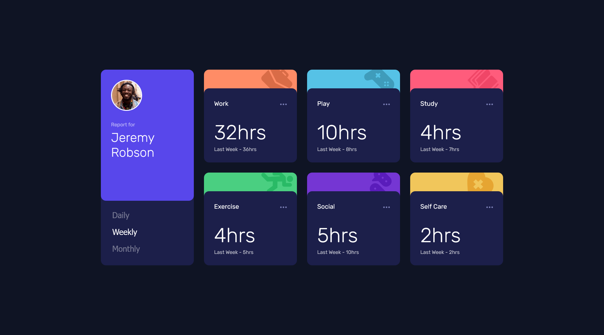

# Frontend Mentor - Time tracking dashboard solution

This is a solution to the [Time tracking dashboard challenge on Frontend Mentor](https://www.frontendmentor.io/challenges/time-tracking-dashboard-UIQ7167Jw). Frontend Mentor challenges help you improve your coding skills by building realistic projects. 

## Table of contents

  - [Screenshot](#screenshot)
  - [Links](#links)
  - [Built with](#built-with)
  - [What I learned](#what-i-learned)
- [Author](#author)

### Screenshot

### Links

- Solution URL: [https://github.com/calebsg225/FM-time-tracking-dashboard/tree/master](https://github.com/calebsg225/FM-time-tracking-dashboard/tree/master)
- Live Site URL: [https://calebsg225.github.io/FM-time-tracking-dashboard/](https://calebsg225.github.io/FM-time-tracking-dashboard/)

### Built with

- HTML5
- CSS
- [React](https://reactjs.org/) - JS library
- TypeScript

### What I learned

I learned that svg files don't play well with TypeScript in React...

## Author

- Frontend Mentor - [@yourusername](https://www.frontendmentor.io/profile/calebsg225)